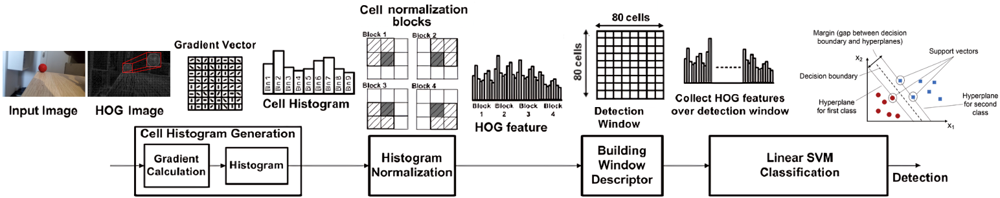
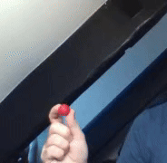

# HOG-SVM Object Detection Pipeline

## Table of Contents

1. [Overview](#overview)
2. [What is HOG+SVM?](#what-is-hogsvm)
3. [Pipeline Structure](#pipeline-structure)
4. [Requirements](#requirements)
5. [Usage Instructions](#usage-instructions)  
   5.1. [Resizing Images](#1-resizing-images)  
   5.2. [Labeling Images](#2-labeling-images)  
   5.3. [Training the Model](#3-training-the-model)  
   5.4. [Validating the Model](#4-validating-the-model)  
   5.5. [Testing with Pre-trained Model](#5-testing-with-pre-trained-model)
6. [Advantages and Disadvantages](#advantages-and-disadvantages)
7. [License](#license)

## Overview

This project implements an object detection pipeline using Histogram of Oriented Gradients (HOG) as a feature extractor and Support Vector Machines (SVM) as the classifier. It provides an example pipeline where images are resized, labeled, and trained using Dlib's object detection framework. 

### What is HOG+SVM?

**HOG (Histogram of Oriented Gradients)** is a feature extraction method that describes the structure and appearance of an object by analyzing gradient orientations in localized portions of an image. It’s widely used in object detection, especially for its robustness to variations in lighting and pose.

**SVM (Support Vector Machine)** is a supervised machine learning algorithm that classifies data by finding the hyperplane that best separates the feature space into categories. 

In the context of object detection, HOG features are extracted from the images and fed into an SVM for training. The trained SVM can then be used to classify objects in new images.

For a visual understanding of the HOG+SVM process:


## Pipeline Structure

```
object_detection_HOG-SVM_pipeline
├── assets
├── images
│   ├── resizer.py
│   ├── test
│   ├── train
│   └── validation
├── README.md
├── resources
│   ├── ball_recognition_exemple.svm
│   ├── test_label.xml
│   └── train_label.xml
└── scripts
    ├── detector4images.py
    ├── detector4webcam.py
    └── train.py
```

## Requirements

Before running the pipeline, ensure that you have the following Python libraries installed:

- **Dlib** (for object detection and training)
- **OpenCV** (for image processing and webcam access)
- **NumPy** (for numerical computations)

To install these dependencies, run the following command:

```bash
pip install dlib opencv-python numpy
```

Additionally, make sure you have a C++ compiler installed to build Dlib, as it requires compilation. On Ubuntu, you can install the necessary packages with:

```bash
sudo apt-get install build-essential cmake
sudo apt-get install libgtk-3-dev libboost-all-dev
```

Once these are installed, you should be ready to run the pipeline.

## Usage Instructions

### 1. Resizing Images
To begin, you must resize the training, test, and validation images based on your desired detection frequency. The resizing script adjusts the image resolution to achieve a balance between frequency and resolution, as shown in this graph:


 By default, the frequency is set to 10Hz for an image resolution of 288x216px.


Run the following command in the `images` directory:
```bash
python resizer.py
```

### 2. Labeling Images
To generate the XML label files for Dlib, you can use the [**Imglab**](https://solothought.com/imglab/) labeling tool. Once the labeling is done, save the files in Dlib's XML format. Place the generated label files in the `resources` folder. 

The sample label files for training and testing are already provided (`train_label.xml` and `test_label.xml`).

### 3. Training the Model
Before training, ensure that the paths to the images are correctly set in the XML label files. Once confirmed, execute the training script:

```bash
python train.py
```

This script uses Dlib to train an object detector based on the labeled data. You can customize the hyperparameters of the training process by referring to the Dlib documentation: [Dlib Object Detector Training Options](http://dlib.net/python/index.html#dlib_pybind11.simple_object_detector_training_options).

### 4. Validating the Model
To validate the trained model on test images, execute the following command:

```bash
python detector4images.py
```

The script will output the results of the model's performance on the test images.

### 5. Testing with Pre-trained Model
If you want to test the pipeline using a pre-trained model, a trained SVM model on 100 images is provided (`ball_recognition_exemple.svm`). You can test it on your webcam by running:

```bash
python detector4webcam.py
```

An example of the webcam output:
<p align="center">
    
</p>

## Advantages and Disadvantages

| **Advantages** | **Disadvantages** |
|----------------|-------------------|
| Works without a GPU | Requires a minimum image size |
| Small dataset is sufficient for good results (5 images here) | Minimum object size (400px²) required for detection |
| High frequency achievable with small image sizes | Small objects in the image may not be detectable due to lack of detail |

By following this pipeline, you can quickly train and test object detection models using HOG+SVM, even with limited computational resources.

## License

This project is licensed under the [BSD 3-Clause License](LICENSE).